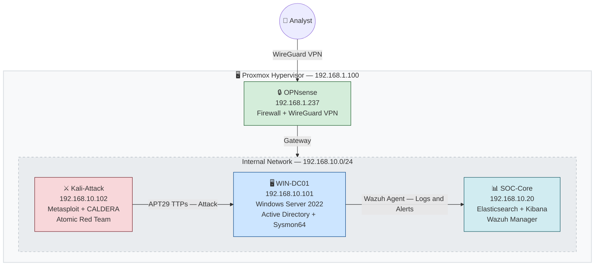

# 🛡️ Adversary Defense Lab

> Real adversary emulation, detection and defense in a complete cycle inside a functional lab.

[](https://github.com/TheCyberDefenseGuy/adversary-defense-lab)
[](https://github.com/TheCyberDefenseGuy/adversary-defense-lab/tree/main/adversaries)
[](https://attack.mitre.org/)
[](https://www.elastic.co/)
[](https://wazuh.com/)
[](LICENSE)

---

## What is this project

The Adversary Defense Lab is a cybersecurity lab built to emulate real APT groups, detect their techniques using a functional SIEM, and document actionable defense strategies based on the MITRE ATT&CK framework and CIS Controls.

The goal is not just to run attacks. It is to close the full loop:

```
Adversary Emulation -> SIEM Detection -> Evidence Analysis -> Defense Strategy
```

Each documented APT includes the group profile with real campaign history, the phase-by-phase attack timeline with MITRE ATT&CK TTPs mapped, functional emulation scripts tested in the lab, Elastic SIEM detection rules created via API, a Kibana dashboard deployable with a single command, Sigma rules for portability to Splunk, Sentinel and QRadar, and MITRE mitigations with the corresponding CIS Controls per technique.

---

## Lab Architecture



The analyst accesses the lab remotely via WireGuard VPN on OPNsense. Kali-Attack emulates APT29 techniques directly against WIN-DC01. The Wazuh Agent installed on WIN-DC01 collects all events and sends them to SOC-Core where Elasticsearch, Kibana and Wazuh Manager process, correlate and generate alerts.

---

## Technology Stack

| Component | Technology | Version |
|---|---|---|
| Hypervisor | Proxmox VE | 8.x |
| SIEM | Elasticsearch + Kibana | 8.19 |
| EDR/XDR | Wazuh Manager + Agent | 4.14.5 |
| Log Shipper | Filebeat | 8.19 |
| Endpoint | Windows Server 2022 | AD lab.local |
| Sysmon | Sysmon64 Olaf config | 15.x |
| Attack Platform | Kali Linux | 2024.x |
| C2 Framework | Metasploit | 6.4 |
| Emulation | CALDERA + Atomic Red Team | latest |
| Firewall and VPN | OPNsense + WireGuard | latest |

---

## Documented Adversaries

| APT | Name | Origin | TTPs | Status |
|---|---|---|---|---|
| [APT29](adversaries/APT29-Cozy-Bear/) | Cozy Bear | Russia (SVR) | 12 | ✅ Complete |
| APT28 | Fancy Bear | Russia (GRU) | coming soon | 🔜 |
| Lazarus Group | Hidden Cobra | North Korea | coming soon | 🔜 |

---

## How to use this repository

### Step 1 - Set up the Lab

Follow the infrastructure guide that documents the creation of all VMs, configuration of the Elastic Stack, Wazuh and Sysmon.

```bash
cat infrastructure/README.md
```

### Step 2 - Choose an APT

Each adversary has its own directory with profile, attack timeline, scripts and defense documentation.

```bash
cat adversaries/APT29-Cozy-Bear/README.md
```

### Step 3 - Run the Emulation

```bash
cd adversaries/APT29-Cozy-Bear/03-emulation/
chmod +x auto-lnk.sh
./auto-lnk.sh
```

### Step 4 - Deploy Detection Rules

```bash
python3 adversaries/APT29-Cozy-Bear/04-detection/elastic/apt29-create-rules.py
```

### Step 5 - Deploy the Kibana Dashboard

```bash
chmod +x adversaries/APT29-Cozy-Bear/04-detection/elastic/apt29-dashboard-deploy.sh
./adversaries/APT29-Cozy-Bear/04-detection/elastic/apt29-dashboard-deploy.sh
```

### Step 6 - LLM Pipeline (optional)

The pipeline supports two modes. Without an API key it uses pre-defined local queries. With the Anthropic API key, Claude generates dynamic KQL queries based on the TTP context.

```bash
python3 tools/llm-pipeline/ttp-to-rule.py --list
python3 tools/llm-pipeline/ttp-to-rule.py --apt APT29

export ANTHROPIC_API_KEY=sk-ant-...
python3 tools/llm-pipeline/ttp-to-rule.py --apt APT29
```

---

## Repository Structure

```
adversary-defense-lab/
│
├── README.md
├── README-en.md
│
├── infrastructure/
│   ├── README.md
│   ├── proxmox-setup.md
│   ├── soc-core-setup.md
│   ├── win-dc01-setup.md
│   └── sysmon-config.xml
│
├── adversaries/
│   └── APT29-Cozy-Bear/
│       ├── README.md
│       ├── 01-profile/
│       │   └── apt29-profile.md
│       ├── 02-attack-phases/
│       │   └── attack-timeline.md
│       ├── 03-emulation/
│       │   ├── README.md
│       │   ├── auto-lnk.sh
│       │   └── lnk_payload.py
│       ├── 04-detection/
│       │   ├── README.md
│       │   ├── elastic/
│       │   │   ├── apt29-detect-v4.py
│       │   │   ├── apt29-create-rules.py
│       │   │   └── apt29-dashboard-deploy.sh
│       │   └── sigma/
│       │       └── apt29-rules.yml
│       └── 05-defense/
│           ├── README.md
│           ├── mitre-mitigations.md
│           └── cis-hardening.md
│
├── tools/
│   └── llm-pipeline/
│       └── ttp-to-rule.py
│
└── articles/
    ├── apt29-pt.md
    └── apt29-en.md
```

---

## Prerequisites

To set up the full lab you need Proxmox VE 8.x or an alternative like VMware or VirtualBox, Python 3.10 or higher with the requests and urllib3 libraries, Bash 5.x available on Kali Linux, and the curl and jq tools installed.

```bash
pip install requests urllib3
```

| Resource | Minimum | Recommended |
|---|---|---|
| CPU | 8 cores | 12 cores or more |
| RAM | 16 GB | 32 GB |
| Disk | 200 GB SSD | 500 GB NVMe |

---

## How to Contribute

If you want to add a new APT to the repository, fork the project, create the new adversary folder following the same structure as APT29, add the TTPs to the ttp-to-rule.py file and submit a Pull Request with evidence from your lab.

```bash
mkdir -p adversaries/APT28-Fancy-Bear/{01-profile,02-attack-phases,03-emulation,04-detection,05-defense}
```

Check [CONTRIBUTING.md](CONTRIBUTING.md) for the full contribution guide.

---

## Legal Notice

This repository is exclusively for educational and research purposes in controlled environments. Using the techniques documented here on systems without explicit written authorization is illegal and the full responsibility of whoever does it.

---

## References

- [MITRE ATT&CK Framework](https://attack.mitre.org/)
- [CIS Controls v8](https://www.cisecurity.org/controls/v8)
- [Elastic Security Documentation](https://www.elastic.co/guide/en/security/current/index.html)
- [Wazuh Documentation](https://documentation.wazuh.com/)
- [Sigma Rules](https://github.com/SigmaHQ/sigma)
- [Atomic Red Team](https://github.com/redcanaryco/atomic-red-team)
- [CALDERA](https://github.com/mitre/caldera)
- [MAD20 Adversary Emulation](https://mad20.io/)
- [CIS Benchmark Windows Server 2022](https://www.cisecurity.org/benchmark/microsoft_windows_server)

---

## Author

**TheCyberDefenseGuy**

GitHub: [@TheCyberDefenseGuy](https://github.com/TheCyberDefenseGuy)

Project: [adversary-defense-lab](https://github.com/TheCyberDefenseGuy/adversary-defense-lab)

---

Built with dedication for the cybersecurity community.
