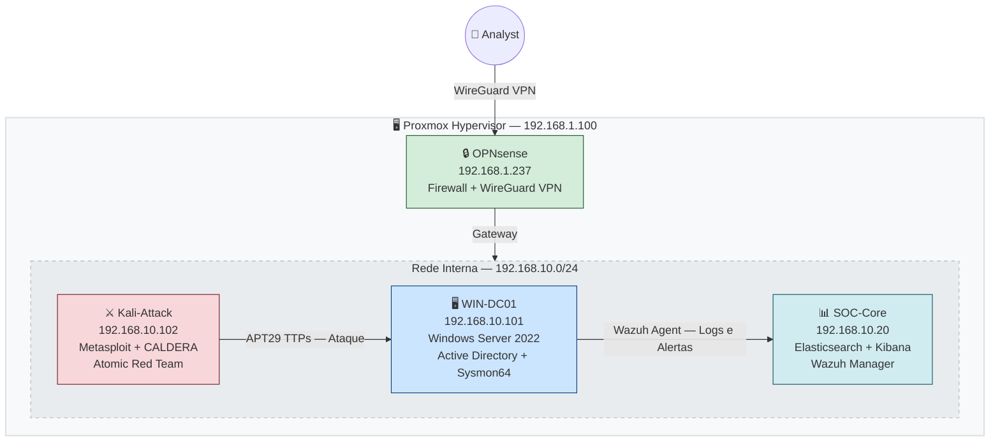

# 🛡️ Adversary Defense Lab

> Emulação de adversários reais, detecção e defesa em ciclo completo dentro de um laboratório funcional.

[](https://github.com/TheCyberDefenseGuy/adversary-defense-lab)
[](https://github.com/TheCyberDefenseGuy/adversary-defense-lab/tree/main/adversaries)
[](https://attack.mitre.org/)
[](https://www.elastic.co/)
[](https://wazuh.com/)
[](LICENSE)

---

## O que é este projecto

O Adversary Defense Lab é um laboratório de cibersegurança construído para emular grupos APT reais, detectar as suas técnicas com um SIEM funcional e documentar estratégias de defesa accionáveis baseadas no MITRE ATT&CK e no CIS Controls.

O objectivo não é apenas executar ataques. É fechar o ciclo completo:

```
Emulação do Adversário -> Detecção no SIEM -> Análise de Evidências -> Estratégia de Defesa
```

Cada APT documentado inclui o perfil do grupo com histórico de campanhas reais, a timeline do ataque fase a fase com os TTPs mapeados no MITRE ATT&CK, os scripts de emulação funcionais e testados em laboratório, as regras de detecção para Elastic SIEM criadas via API, o dashboard Kibana deployável com um único comando, as Sigma rules para portabilidade para Splunk, Sentinel e QRadar, e as mitigações MITRE com os CIS Controls correspondentes por técnica.

---

## Arquitectura do Lab



O analista acede ao laboratório remotamente via WireGuard VPN no OPNsense. O Kali-Attack emula as técnicas do APT29 directamente contra o WIN-DC01. O Wazuh Agent instalado no WIN-DC01 recolhe todos os eventos e envia para o SOC-Core onde o Elasticsearch, Kibana e Wazuh Manager processam, correlacionam e geram alertas.

---

## Stack Tecnológico

| Componente | Tecnologia | Versão |
|---|---|---|
| Hypervisor | Proxmox VE | 8.x |
| SIEM | Elasticsearch + Kibana | 8.19 |
| EDR/XDR | Wazuh Manager + Agent | 4.14.5 |
| Log Shipper | Filebeat | 8.19 |
| Endpoint | Windows Server 2022 | AD lab.local |
| Sysmon | Sysmon64 config Olaf | 15.x |
| Plataforma de Ataque | Kali Linux | 2024.x |
| C2 Framework | Metasploit | 6.4 |
| Emulação | CALDERA + Atomic Red Team | latest |
| Firewall e VPN | OPNsense + WireGuard | latest |

---

## Adversários Documentados

| APT | Nome | Origem | TTPs | Estado |
|---|---|---|---|---|
| [APT29](adversaries/APT29-Cozy-Bear/) | Cozy Bear | Rússia (SVR) | 12 | ✅ Completo |
| APT28 | Fancy Bear | Rússia (GRU) | em breve | 🔜 |
| Lazarus Group | Hidden Cobra | Coreia do Norte | em breve | 🔜 |

---

## Como usar este repositório

### Passo 1 - Montar o Lab

Segue o guia de infraestrutura completo que documenta a criação de todas as VMs, configuração do Elastic Stack, Wazuh e Sysmon.

```bash
cat infrastructure/README.md
```

### Passo 2 - Escolher um APT

Cada adversário tem o seu próprio directório com perfil, timeline de ataque, scripts e documentação de defesa.

```bash
cat adversaries/APT29-Cozy-Bear/README.md
```

### Passo 3 - Executar a Emulação

```bash
cd adversaries/APT29-Cozy-Bear/03-emulation/
chmod +x auto-lnk.sh
./auto-lnk.sh
```

### Passo 4 - Deploy das Detection Rules

```bash
python3 adversaries/APT29-Cozy-Bear/04-detection/elastic/apt29-create-rules.py
```

### Passo 5 - Deploy do Dashboard Kibana

```bash
chmod +x adversaries/APT29-Cozy-Bear/04-detection/elastic/apt29-dashboard-deploy.sh
./adversaries/APT29-Cozy-Bear/04-detection/elastic/apt29-dashboard-deploy.sh
```

### Passo 6 - LLM Pipeline (opcional)

O pipeline suporta dois modos. Sem API key usa queries locais pré-definidas. Com a API key da Anthropic o Claude gera queries KQL dinâmicas baseadas no contexto do TTP.

```bash
python3 tools/llm-pipeline/ttp-to-rule.py --list
python3 tools/llm-pipeline/ttp-to-rule.py --apt APT29

export ANTHROPIC_API_KEY=sk-ant-...
python3 tools/llm-pipeline/ttp-to-rule.py --apt APT29
```

---

## Estrutura do Repositório

```
adversary-defense-lab/
│
├── README.md
├── README-en.md
│
├── infrastructure/
│   ├── README.md
│   ├── proxmox-setup.md
│   ├── soc-core-setup.md
│   ├── win-dc01-setup.md
│   └── sysmon-config.xml
│
├── adversaries/
│   └── APT29-Cozy-Bear/
│       ├── README.md
│       ├── 01-profile/
│       │   └── apt29-profile.md
│       ├── 02-attack-phases/
│       │   └── attack-timeline.md
│       ├── 03-emulation/
│       │   ├── README.md
│       │   ├── auto-lnk.sh
│       │   └── lnk_payload.py
│       ├── 04-detection/
│       │   ├── README.md
│       │   ├── elastic/
│       │   │   ├── apt29-detect-v4.py
│       │   │   ├── apt29-create-rules.py
│       │   │   └── apt29-dashboard-deploy.sh
│       │   └── sigma/
│       │       └── apt29-rules.yml
│       └── 05-defense/
│           ├── README.md
│           ├── mitre-mitigations.md
│           └── cis-hardening.md
│
├── tools/
│   └── llm-pipeline/
│       └── ttp-to-rule.py
│
└── articles/
    ├── apt29-pt.md
    └── apt29-en.md
```

---

## Pré-requisitos

Para montar o lab completo precisas do Proxmox VE 8.x ou alternativa como VMware ou VirtualBox, Python 3.10 ou superior com as bibliotecas requests e urllib3, Bash 5.x disponível no Kali Linux, e as ferramentas curl e jq instaladas.

```bash
pip install requests urllib3
```

| Recurso | Mínimo | Recomendado |
|---|---|---|
| CPU | 8 cores | 12 cores ou mais |
| RAM | 16 GB | 32 GB |
| Disco | 200 GB SSD | 500 GB NVMe |

---

## Como Contribuir

Se queres adicionar um novo APT ao repositório, faz fork do projecto, cria a pasta do novo adversário seguindo a mesma estrutura do APT29, adiciona os TTPs ao ficheiro ttp-to-rule.py e submete um Pull Request com as evidências do teu lab.

```bash
mkdir -p adversaries/APT28-Fancy-Bear/{01-profile,02-attack-phases,03-emulation,04-detection,05-defense}
```

Consulta o [CONTRIBUTING.md](CONTRIBUTING.md) para o guia completo.

---

## Aviso Legal

Este repositório é exclusivamente para fins educativos e de investigação em ambientes controlados. O uso das técnicas aqui documentadas em sistemas sem autorização explícita por escrito é ilegal e da inteira responsabilidade de quem o fizer.

---

## Referências

- [MITRE ATT&CK Framework](https://attack.mitre.org/)
- [CIS Controls v8](https://www.cisecurity.org/controls/v8)
- [Elastic Security Documentation](https://www.elastic.co/guide/en/security/current/index.html)
- [Wazuh Documentation](https://documentation.wazuh.com/)
- [Sigma Rules](https://github.com/SigmaHQ/sigma)
- [Atomic Red Team](https://github.com/redcanaryco/atomic-red-team)
- [CALDERA](https://github.com/mitre/caldera)
- [MAD20 Adversary Emulation](https://mad20.io/)
- [CIS Benchmark Windows Server 2022](https://www.cisecurity.org/benchmark/microsoft_windows_server)

---

## Autor

**TheCyberDefenseGuy**

GitHub: [@TheCyberDefenseGuy](https://github.com/TheCyberDefenseGuy)

Projecto: [adversary-defense-lab](https://github.com/TheCyberDefenseGuy/adversary-defense-lab)

---

Construído com dedicação para a comunidade de cibersegurança.
